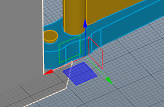
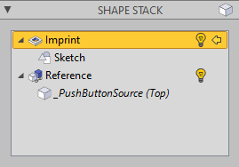

This page explains some of the standard editing tools.

# Working Plane

One of the most relevant helper in modelling is the working plane. On this plane the grid is laid out and new primitives and sketches are made. Even if there is always the possibility of changing the position and orientation of bodies, it is very helpful to have the plane and the snapping grid available when creating new bodies.

The working plane can be moved using commands in the __Working Plane__ ribbon group in the __Edit__ tab or using the context menu in the viewport. The three world maps are available as a default; the plane can also be aligned with a face, an edge or a vertex. 

The work plane can also be saved in order to recreate it later in the same position. This is done by creating the auxiliary object __[Datum Plane](xref:322f5cc2-0fc7-43f9-bb80-5e87cb3e3651)__ using the corresponding ribbon button on the __Model__ tab.

> [!Tip] The currently set grid spacing is displayed in its original size at the bottom right of the viewport, provided that it can be displayed in terms of size. When the mouse pointer is on this display, the grid spacing can be conveniently enlarged or reduced using the mouse wheel.

# Transform

_Transform_ is one of the most important tools. It works on bodies and offer the opportunity to change their position and orientation in the model.

The tool is started via the ribbon button __Transform__ in the __Edit__ tab, via the context menu in the viewport or via the keyboard shortcut __T__. The transform tool has two modes, which can be switched through by repeatedly pressing the buttons or the __T__ key: move and rotate. The change is made by touching the axes, planes between the axes or circles and moving the mouse. By holding down the __Ctrl__ key, the change is discretized to the stepping of the grid in _move_ mode or to 5° in _rotation_ mode.

The pivot has a special meaning: this is the point at which the gizmo originates, and at this point the rotation is carried out. A number of options are available for setting the pivot.

Another option is whether bodies referenced in the shape stack - so-called foreign bodies - should also be moved. This is necessary if the shape itself must not change.

# Duplicate / Reference

The _Duplicate_ and _Create Reference_ tools also require some explanation. Both apparently lead to the same result at first: The selected body is twice in the model. 

With _Duplicate_, the entire body including the entire shape stack is duplicated. If a change is made to the new or old body, this does not affect the other. 

With _Create Reference_ also a new body is created, but this refers to the shape of the original body. If the shape of the original body is changed, the shape of the new body also changes. Regardless of this, the new body can again accept new modifiers in order to further edit the inherited shape.

# Convert to Solid / Convert to Editable Sketch

It can be helpful for various reasons to collapse a shape stack and continue using the resulting shape as a starting point. Reasons can be:
- Eliminating dependencies on bodies attracted to the shape stack.
- Avoiding circular dependencies.
- Optimization if the shape stack is complex and the shape may be referenced multiple times.
- Converting a mesh shape into a solid to enable modeling tools

For sketches in particular, there is another advantage: the conversion converts the sketch back into a version that can be edited with the sketch editor. However, the contents of the sketch are mapped to the available segment types, which may lead to restrictions.

Bodies with a shape stack of type _Mesh_ can also be converted into a new shape stack with a _Solid_ as the basis. This enables further processing with all modeling tools, which typically only work on solids. However, this conversion has limitations: The geometric shape itself is not changed. This means that while coplanar triangles are joined together to form a face, "round" structures remain as angular as they were when they were originally tessellated. 

> [!Tip] If the body is already referenced by another body, this referencing may be lost. This is particularly the case if an intermediate step in the shape stack is referenced. One way to solve this is to convert these shapes at the same time. To do this, simply select all the bodies in question and then trigger the conversion.
