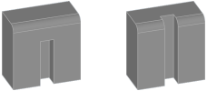

This page explains the basic concept behind the topology of a Macad\|3D model.

# Models and Bodies

A model contains all the data and information that is used to build it. The construction itself is done by modeling individual parts, called bodies, from which the real model is later assembled. These bodies have a certain shape and a position in the model.

Bodies are organized using layers. Each body can be assigned to exactly one layer. Via layers The visualization can be controlled, bodies can be frozen, isolated or hidden.

# Shapes

The shape of a body is defined by a stack of operators, the _Shape Stack_. Each stack typically starts with a _primitive_ like box or cylinder. In the modelling process, you push _modifiers_ onto the stack, which take the shape from the predecessor and manipulates it. The result of the topmost modifier is then taken as the shape of the body.

Some modifiers work wih a set of parameters, some need other shapes as operands. These operand shapes can be part of the same body, or a reference to another - _foreign_ - body. Each time the foreign body is modified or moved, the shape stack will be re-generated from the point where it relies on that body. If you delete the foreign body, it's reference will be substituted by a "_Solid_" primitive containing the last valid shape before deletion.

The shape of a body can be of one of the following types:

Type       | Purpose
-----------|-------------------------
__Solid__  | 3D shape defined by geometric definition of it's boundary ([B-Rep](xref:#see-Also)). This type is used for construction and works with almost all modifiers and exporters.
__Sketch__ | 2D vector drawing, used as operand for modifiers. Some modifiers build a solid type shape out of a sketch (e.g. [Extrude](xref:240a3c08-f9a0-4e31-88e0-7b034c1d9f9d)). See [Sketches](xref:0dc12d15-5450-460c-909b-f25ed1cf4b7e) for further information.
__Mesh__   | 3D shape defined by triangles. Can only be displayed, not manipulated, but [converted to solids](xref:e0d6ed71-f1fa-481b-94b4-c7f76591b1b4#shape-stack-converter).

# Sub-shapes

Shapes of type _solid_ consist of several sub-shapes: _Vertices_, _Edges_ and _Faces_. Modifiers typically work on a subset of these shapes, e.g. the [Chamfer](xref:28fda54f-4380-45f4-b55e-23093b6dc6de) modifier works on edges. When sub-shapes are selected, a reference to this sub-shape is stored. This reference is used to find the proper again when the modifier needs zu regenerate the shape.

If the shape predecessor changes - because of skipped or inserted modifiers, or changes to the parameters - then it may be that the sub-shape can no longer be found or the wrong sub-shape is determined. You will notice this when the modifier no longer shows the desired result or even throws an error. In this case, all modifiers offer the option to select the sub-shape again. 

In many cases, however, the sub-shape reference is executed in such a way that the desired sub-shape can be recognized even if it has been changed.

The above also applies to shapes of type _sketch_, but limited to _vertices_ and _edges_. Shapes of type _mesh_ do not contain any sub-shape.

# See Also
[B-Rep overview on Wikipedia](https://en.wikipedia.org/wiki/Boundary_representation)