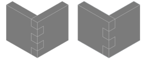
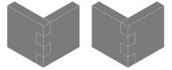
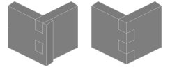
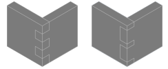
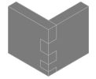

---
uid: c0d4325e-1684-4449-b71d-5fa1c875dd5c
title: Box Joint
---
Build a junction of two solids by using interlocking profiles.

# Property Panel
Box Count
:   Number of interlocking boxes.
    

Change Order
:   Toggles the side from which the box alternation starts. With even box count, this determines which solid has the upper and which the lower box. With uneven box count, it determines the overall count for each solid.
    

Remove Excess
:   Removes small parts which remain after cutting the boxes. 
    This can be set separately for each part.
    

Box Size Mode
:   Defines how the sizes of the boxes are determined. The following modes can be selected:
    * __Auto__: The size of the boxes will be identical for all boxes of a part. The ratio of the box size of both parts can be set.
    * __Custom__: The size of the boxes can be defined manually for every box.

Size Ratio
:   _Only available if Box Size Mode is set to Auto_
    Defines the ratio of the size of the boxes for both parts.
    

Custom Ratios
:   _Only available if Box Size Mode is set to Custom_
    A table where the size ratio can be defined per box. The sum of all boxes must be 100%. The size of the last box cannot be set, it is calculated automatically to meet this requirement.
    

# Remarks

The modifier will be added to the shape stack of both involved bodies. Most parameters will be changed for both bodies accordingly. If the modifier is removed from the shape stack of one body, it is removed also from the other.

# Creating a Box Joint

1. Select the solid.
2. Select __Box Joint__ from ribbon menu.
3. Select the other solid.
4. Adjust the parameters in the property panel.
