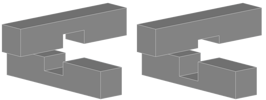
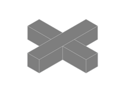
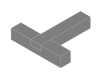
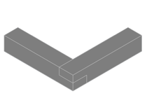
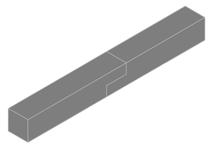

---
uid: ee35e475-eb9c-4871-9da8-e04e53faef6a
title: Halved Joint
---
Build a junction of two solids by removing half of the thickness from each part.

# Property Panel
Size Ratio
:   Defines the ratio of the material thickness of each of the parts.
    
Orientation
:   If set to _Auto_ the orientation of the half-cut will be determined automatically. If set to _Custom_ the desired orientation can be selected in the viewport.
Select Orientation
:   Click to re-select the orientation in the viewport.
    _Only available if Orientation is set to Auto_

# Remarks

The modifier will be added to the shape stack of both involved bodies. The parameters will be changed for both bodies accordingly. If the modifier is removed from the shape stack of one body, it is removed also from the other.

The modifier uses the overlap to determine the direction and depth of material removal. For this to work, the shapes involved must be four-sided and straight. Furthermore, the two parts must be able to slide into each other; any additional material removal to ensure this is not determined by this modifier.

If the automatism does not find a solution or another cutting direction is desired, this can be set directly in the viewport via the _Orientation_ setting.

Multiple joints are created if the two shapes overlap at several points. Custom orientation can be selected for each of this joints separately.

The following cases are supported:

# Creating a Halved Joint

1. Select the solid.
2. Select __Halved Joint__ from ribbon menu.
3. Select the other solid.
4. Adjust the parameters in the property panel.
