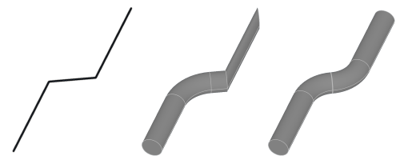

Creates a pipe by sweeping a profile along a modelled path. Pipes can be applied to sketches only, where the path is taken from.

# Property Panel

Profile
:   Defines the profile of the pipe. There are some predefined profiles that can be parameterized. By selecting _Custom_, a sketch is created which can be given a specific shape. The profile sketch is can be selected via the shape stack.

    

Dimension
:   Scales the profile uniformly (if the option _symmetric profile_ is checked) or separately in width and height. The size information refers to the total width or total height.
    This parameter is only available for predefined profiles only.

Rotation
:   Rotates the profile around it's center.
    This parameter is only available for predefined profiles only.

Bend Radius
:   Defines the bending radius that is possible or should be achieved depending on the tool and material. The bending radius is applied to any sharp corners. See remarks for details.
    If the _Automatic_ option is checked, the bending radius is determined automatically during the calculation, which is the size of the profile size.

# Remarks

One of the key functions of the Pipe modifier is the automatic creation of bends. This enables the path to be defined with polylines, while the result shows the possible bending of the material.

To do this, the segments of the path are cut and replaced by a curve. This is done wherever the path itself does not define a smooth transition between the segments.

However, this fitting of bends cannot take place if the segments are not long enough to accommodate the bends. The leads not only to sharp corners, but also to a misaligned profile. A warning is given in the log window.

This problem can be solved in three ways:
- Lengthening the segment length
- Reducing the bending radius so that bends are smaller
- Create the soft transition directly in the sketch

> [!Note] The bending points are only inserted at the transition between segments. If a segment itself has a tight bend, this will not be taken into account.

The sketch can define more than one path. A pipe is generated for each path separately. 

Paths can be closed.

# Creating a Pipe
A pipe can be created on any sketch shape which defines the path.
1. Create a sketch and draw the path.
2. Select __Pipe__ from ribbon menu. 
4. Adjust parameters in the property panel as needed.

# Pipe Drawing

If a bend is calculated using the pipe modifier, a drawing can be generated automatically, which contains a cross-section of the body together with the dimensions of the distances and bend angles. This plan can be used as a template for a replica.

> [!Note] The drawing contains length dimensions that allow for a shortening of the bend. This is strongly dependent on the material, wall thickness and diameter, so only an approximation is achieved here.

## Creating a Pipe Drawing
1. Select the body with a Pipe modifier on it's shape stack.
2. Select __Pipe Drawing__ on the ribbon tab __Toolbox__
3. Enter file path and select file format.

