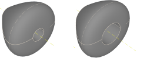
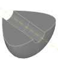
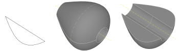

---
uid: 74c0aab4-7847-4dcb-83e9-6ed639f4591c
title: Revolve
---
Creates a solid by revolving a sketch contour.

# Property Panel
Axis
:   Defines the axis to revolve around by selection of one of the three base axes of the local or the world coordinate system.

Offset from Axis
:   The distance of the center of revoltion from the selected coordinate system base axis.
    

Segment
:   If this value is smaller than 360°, a segment of the revolved shape is built using the given angle.
    

# Remarks
> [!Important]Only closed contours can be revolved. If you want the resulting shape to be solid, close the contour on the axis
          you want to revolve around.

# Creating a Revolve

## Creating a revolution by using a sketch contour.
1. Select the sketch which defines the profile.
2. Select __Revolve__ from ribbon menu.
3. Select the axis around which the sketch contour will be revolved.
4. Adjust the axis and other settings in the property panel or using the live tool.
