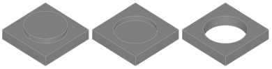

---
uid: D3FAF9BF-849F-4612-B689-BD5F699E850D
title: Imprint
---
Imprints a face based on a sketch to create a protrusion, depression or cutout.

# Property Panel
Mode
:   Defines the mode of the imprint operation. The following modes can be selected:
    * __Raise:__ The structure described by the sketch will be raised to create a protrusion.
    * __Lower:__ The structure described by the sketch will be lowered to create a depression.
    * __Cutout:__ The structure described by the sketch will be punched out.
    
    

Draft Angle
:   The angle to chamfer the sides of the imprint to build a draft.
    

Depth
:   The depth of the imprint.
    This parameter is only available if imprint mode is _Raise_ or _Lower_.

Reselect Face
:   Starts reselection of the target face.

# Remarks
The Imprint modifier uses a sketch to describe the raised, lowered or cut structure. For this, it constructs faces from closed contours. Open contours will be ignored. Contours which are completely inside another contour are considered as holes.

# Creating an Imprint
An imprint can be created on any plane surface of a solid shape. The associated sketch will be automatically created.

1. Select the solid to imprint, and optional a sketch.
2. Select __Imprint__ from ribbon menu.
3. Select the face you want to imprint.
4. The tool starts the sketch editor after creating the imprint.
