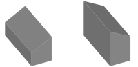
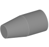

---
uid: ef7f7484-88f2-45d7-8062-771c8c0ad04e
title: Taper
---
Tapers a face of a solid guided by a base edge or vertex.

# Property Panel
Angle
:   The angle of the taper relative to the face. If the angle is positive, material is removed to build the taper. If the angle is negative, material is added.
    

Offset
:   Moves the start of the taper in it's direction.
    > [!Tip] The offset is most useful when tapering rods starting in the middle of the rod to the end, e.g. for yards or booms.
    
    

Reselect Face
:   Starts reselection of the face and the base edge or vertex.

# Remarks
The taper modifier does only work on plane, conic or cylindrical faces.

The direction of the tapering is defined by an edge or vertex of the face. When using an edge, the direction is perpendicular to the edge tangent at the point where the edge was selected.

When using a vertex, then the direction is the mid vector of the tangents of the adjacent edges.

In both cases the faces remains unchanged at the selected point and will be tapered in the given direction.

> [!Caution] The algorithm has it's limitation when the part of the shape, which is affected by the taper, gets too complex. If you get problems here, try to achieve the taper using a box and Boolean Cut instead.

# Creating a Taper
A taper can be created on any solid shape.
1. Select the solid to taper.
2. Select __Taper__ from ribbon menu.
3. Select the face you want to taper.
4. Select an edge or a vertex of the selected face as the base part of the taper.
   The direction of the taper is previewed in the form of an arrow.
   