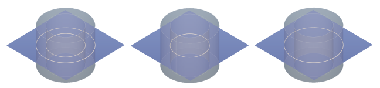

Creates a cross section sketch by cutting the solid with a plane.

# Property Panel
Contours
:   Determines whether the cut lines of the outer edges, the inner edges or both are used.

    

Orientation
:   The orientation of the plane as a rotation angle around the X-axis and the Y-axis.

Offset
:   The displacement of the plane from the pivot point of the body.

Take Working Plane
:   Adopts the working plane again as the section plane.

# Creating a Cross Section

1. Set the working plane as the starting point for the cutting plane.
2. Select the solid to get the result of the operation.
3. Select __Cross Section__ from ribbon menu group __Boolean__.
4. Adjust the section plane exactly by rotating and moving it.
