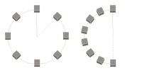
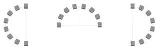
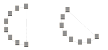
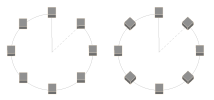

---
uid: 07407809-3236-4469-ad99-526aab13b6e7
title: Circular Array
---
Adds a number of copies of a sketch or a solid, which are arranged on a circle, to the shape.

# Property Panel
Plane
:   _Only for solid type bodies._
    The plane on which the arrangement is placed. Currently only the three standard local planes are available.

Quantity
:   The number of parts of the arrangement, including the original one.

Radius
:   The radius of the circle, on which the copies will be arranged.

Angle Range
:   Defines the range of the circle, in which the copies will be arranged. The angle between each element will be `Range / (Quantity - 1)`.
    

Alignment
:   Defines the distribution of the elements in relation to the original element.
    * __First:__ The original element will be the first element.
    * __Center:__ The original element will be the central element. In this mode, the original element may be moved if _Quantity_ is even.
    * __Last:__ The original element will be the last element.
    
    

Original Angle
:   The angle of the circle center to the original shape pivot. Use this parameter to rotate the circle or rather move the center of the circle.
    

Keep Orientation
:   If checked, all copies will keep the orientation of the original. Otherwise the elements will be rotated accordingly to their position on the circle.
    

# Remarks
The circle center is defined by the shape pivot being a point on the circle, the _Radius_ as the distance of the shape pivot to the circle center, and the _Original Angle_ as the angle of the shape pivot on the circle. To move the center of the circle, adjust the _Radius_ and the _Original Angle_.

# Creating a Circular Array
1. Select a sketch or a solid.
2. Select __Circular Array__ from ribbon menu.
3. Adjust the offset in the property panel.

# See Also

