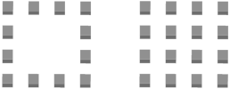

---
uid: c867c6ad-f4ce-432b-a097-99596e31fea1
title: Linear Array
---
Adds a number of copies of a sketch or solid, which are arranged in a linear pattern, to the shape.

# Property Panel
Plane
:   _Only for solid type bodies._
    The plane on which the arrangement is placed. Currently only the three standard local planes are available.

Rotation
:   Rotates the plane on which the arrangement is placed. The rotation center is the shape pivot.

Border
:   If checked, only the outer elements forming a rectangle will be created, the inner elements will be skipped.
    

Quantity
:   _Per direction._
    The number of rows of the arrangement in the given direction. The total quantity of the whole arrangement is `Quantity1 x Quantity2`, and for border mode `(Quantity1 + Quantity2 - 2) * 2`.

Distance
:	_Per direction._
    The distance between each elements in this direction, or the length of the whole arrangement in this direction, dependending on the _Distance Mode_.

Distance Mode
:   _Per direction._
    Defines the mode of interpreting the <ui>Distance</ui> property.
    * __Interval:__ Each element is moved by the given distance.
	* __Spacing:__ The distance specifies the space between two elements.
	* __Extent:__ Each element is moved by an amount of `Distance / Quantity`.
	* __Overall Extent:__ The distance specifies the overall extent from the beginning of the first to the end of the last element.

Alignment
:   _Per direction._
    Defines the distribution of the elements in relation to the original element.
	* __First:__ The original element will be the first element.
	* __Center:__ The original element will be the central element. In this mode, the original element may be moved if _Quantity_ is even.
	* __Last:__ The original element will be the last element.

# Creating a Linear Array
1. Select a sketch or a solid.
2. Select __Linear Array__ from ribbon menu.
3. If created from solid, select the plane on which the multiplied elements will be distributed.
4. Adjust parameters in the property panel or using the live tools.

# See Also

