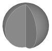

---
uid: eecb316b-a4da-441b-b9a6-3fadf9275889
title: Sphere
---
Create a full or a segment of a sphere shape. The sphere can be truncated on the bottom and the top.

# Property Panel
Radius
:   The radius of the sphere.

Segment
:   If this value is smaller than 360°, a segment of the sphere is built using the given angle for the segment size in longitudinal direction.
    

Extents (Lat)
:   Defines the extent of the sphere in lateral direction. The given values set the maximum and minimum latitude to create the sphere to.</para>
    ![Sphere with _Extents = [-20°, 45°]_](SphereExtents.png)

# Creating a Sphere

The sphere will be created with the center point on the working plane, so consider setting up the working plane before starting.

1. Select __Create Sphere__ from ribbon menu.
2. Select the center point of the sphere on the working plane.
3. Select any rim point of the sphere. This will define the radius.

> [!Note] The pivot point is always set in the center of the sphere.
