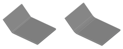

---
uid: 5F9B1A87-60F9-448A-860A-567EB18473C8
title: Flange Sheet
---
Extends a solid shape by adding a bended flange.

# Property Panel
Length
:   The length of the flange, measured beginning at the end of the bend part.

Angle
:   The angle of the flange. Use the button __Swap Side__ to change the direction. The angle also influences the length of the bend part.

Radius
:   The radius of the bend part. This mostly influences the length of the bend part.
    > [!Warning] The bend radius should be selected carefully with respect to the material. Selecting a radius which cannot be achieved with the used material can lead to deviations of the desired dimensions of your part.

    

Gaps
:   This parameters will add a free space on the sides, making the flange smaller than the original face.
    

Relief Type
:   The type of the relief cut into the bend part to support the bending. The following types can be selected:
    * __None:__ The bend part will be as thick as the flange.
    * __Inside:__ The bend part will be thinned on the inside of the bend to the half of the thickness of the flange.
    * __Outside:__ The bend part will be thinned on the outside of the bend to the half of the thickness of the flange.

    

Reselect Face
:   Starts reselection of the face the flange is being added to.

# Remarks    
This modifier constructs a flange part and a bend part connecting the flange with the original solid.

> [!Caution] While you can freely modifier the flange part, you should be very careful when modifying the bend part, if you plan to unfold the sheet at a later time. The unfolding algorithm needs to recognize the bend part, which is done by analyzing both the topology and the geometry. For the same reason, you must always add a gap between two neighboring flanges.

# Creating a Flange
1. Select the solid you.
2. Select __Flange Sheet__ from ribbon menu.
3. Select the face to be extended by the flange.
4. Adjust the parameters in the property panel.

# See Also

