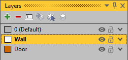
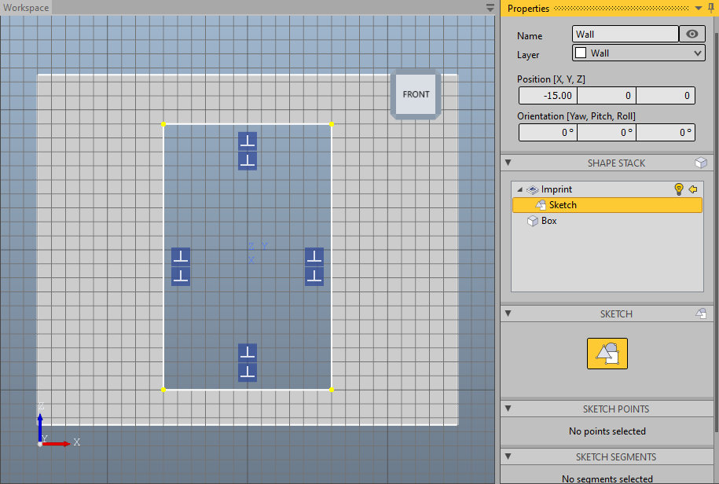
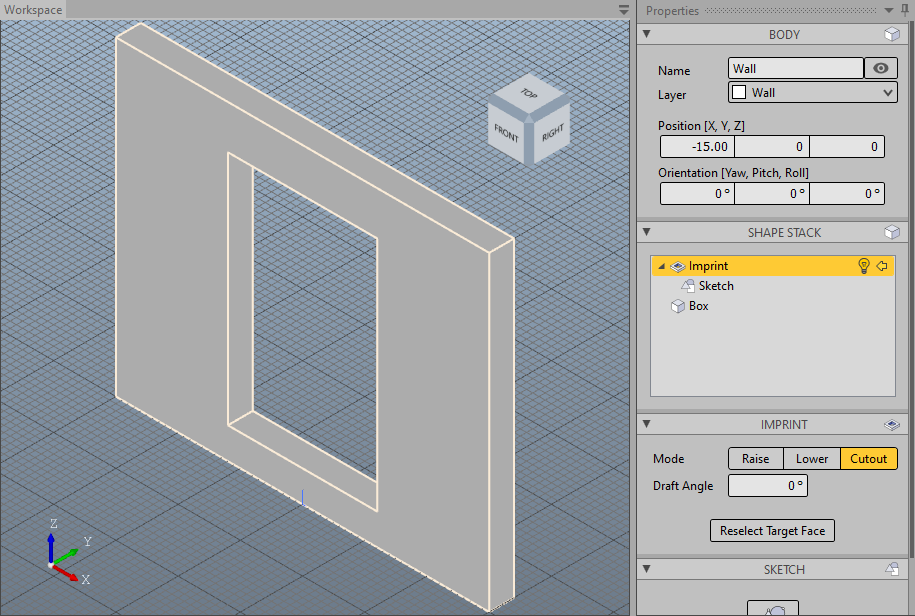
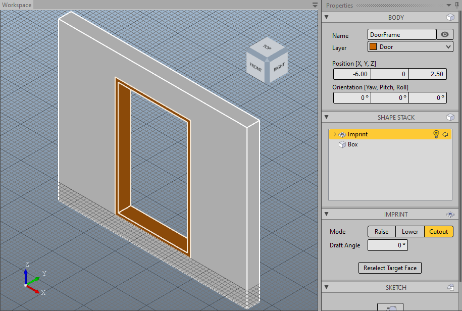
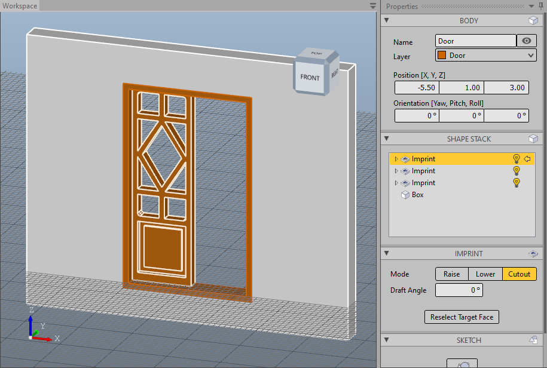
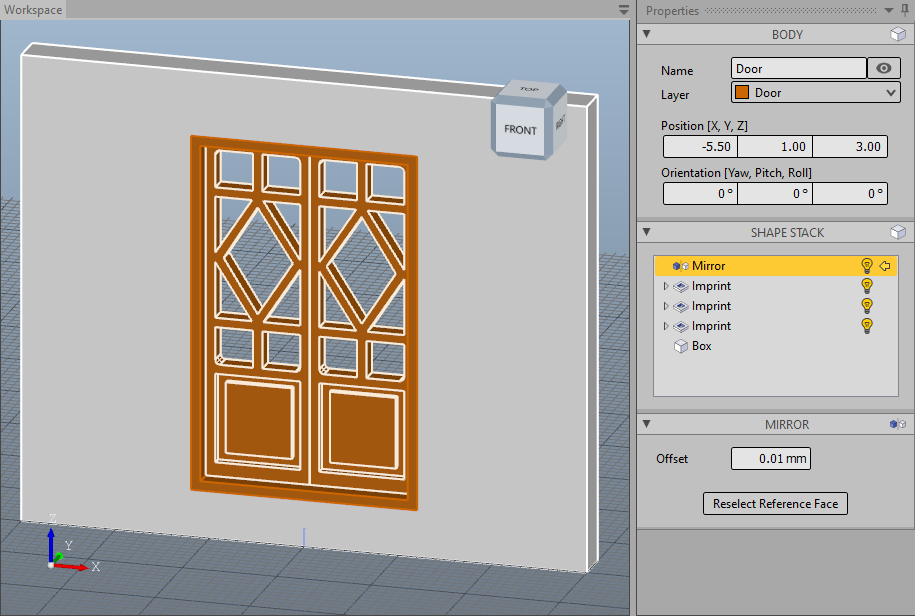
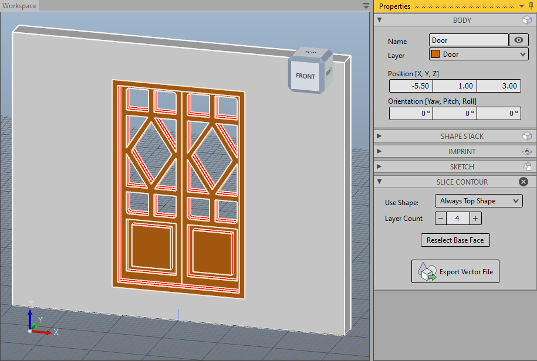
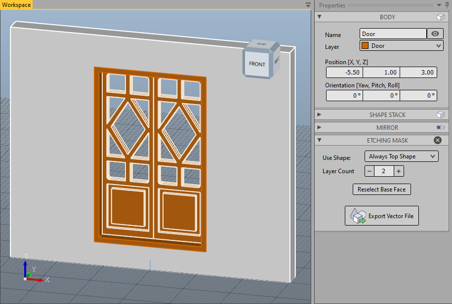
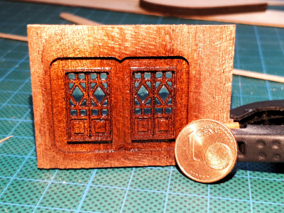

On this page we will create the design for the main entrance door of the Amerigo Vespucci, one of the most beautiful tall ships in the world. We will export production templates for milling or photo etching.

The model file is called _Amerigo Vespucci - EntranceDoor_ and is installed with the samples. The scale is 1:84.

# Layer

In addition to the door itself, we will also create the surrounding wall. For better visual separation, we organize both elements in separate layers. So first we go to the __Layer Editor__, create two new layers, rename them to _Wall_ and _Door_, and set a different color for both. We start with the wall and activate this layer with a double click. New bodies are created in this layer.

# Creating the Wall

We construct the wall using a [Box](xref:5da4906e-c86b-4f91-8b30-f5163e152d0e). To make it easier, we activate the snapping for the grid via the context menu (right mouse button) of the viewport or the __Edit__ tab of the ribbon menu. Both switches - __Enable Snapping__ and __Grid__ - must be activated for this. We set the grid to a __Stepping__ of 1.0 mm.

We select the __Create Box__ tool on the Model tab and first select the two points of the base at -15.0, 0.0 and 15.0, 2.0 on the working plane, resulting in a length of 30.0 mm and a width of 2.0 mm. We then enter the height of 25.0 mm via keyboard and confirm the entry with the __Enter__ key. Our box should now be in place. If values have to be corrected again afterwards, this can be done in the property pane. We change at least the name for this new body.

Now we define the door cutout. To do this, we use the [Imprint](xref:D3faf9Bf-849f-4612-b689-bd5f699e850d) modifier. We choose the tool __Create Imprint__ in the mode _Cutout_. To do this we click on the arrow in the button in the ribbon menu and select __Cut-Out a Face__ from the menu that then opens. We select the front surface of our wall and automatically switch to the sketch editor. We draw a rectangle from -9.0, -6.0 to 10.0, 6.0. Then we close the sketch editor with the __Esc__ key or one of the buttons reading __Close Editor__.

We now have our wall with a door cutout.

# Creating the Door Frame

For the door we switch to the _Door_ layer, e.g. by double-clicking on the layer in the layer editor or by selecting the layer in the dropdown box in the ribbon menu. Then we put the working plane at the height of the door cutout. For this we select the tool __Align Working Plane__ in the __Edit__ tab. This function is also available in the toolbar of the context menu of the viewport. We use the front left vertex as the target of the alignment.

First we create the door frame. We proceed in the same way as with the wall: we create a [Box](xref:5da4906e-c86b-4f91-8b30-f5163e152d0e) that is flush with the wall and then create a cut-out with the [Imprint](xref:D3faf9Bf-849f-4612-b689-bd5f699e850d) modifier from -9.0, -5.5 to 9.0, 5.5. The stepping of the grid should be set to 0.5 mm.

> [!Tip] The snapping function can make work extremely easy, especially if reference points, edges or surfaces are available. In this case, when creating the box for the door frame, the vertices of the wall can serve as a reference for all points to be selected.

# Creating the Door

The door has two symmetrical door leaves, so we will simplify the work by constructing only the left door leaf and deriving the right one from it. We first align the working plane to the door frame. Since the door is lower, this time we take the rear left vertex as a reference and open a box from there so that it fills half of the door frame in width and in depth.

We create the decoration in the lower part of the door using two [Imprints](xref:D3faf9Bf-849f-4612-b689-bd5f699e850d), but this time we use the _lower mode_ once to achieve a recess of 0.5 mm, then the _raise mode_ to create an increase of 0.3 mm within this recess.

We create the decoration in the upper part with a single [Imprint](xref:D3faf9Bf-849f-4612-b689-bd5f699e850d) in _cut-out mode_. A little work is required in the sketch editor to recreate the cutouts nicely.

For the second door we add a [Multiply Mirror](xref:6578fa5e-7536-4df2-96fc-18a31a4cee9c). To do this, we select the __Mirror__ menu item in the __Edit__ tab and select the middle side surface of the door leaf as the mirror surface.

# Templates for Milling

Since we want to make the door in one piece, we add the door frame to the door. For this we select the menu item __Fuse__ in the tab __Model__ and select the door frame.

In order to mill out the door, we need the contour lines of all edges so that we can create milling paths from them in the CAM tool. These are created by slicing the construction layer by layer and exporting the resulting cutting lines as vectors. To do this, we select the __Slice Contour__ menu item in the __Toolbox__ tab. This tool shows us the cutting lines through the body in red; we get the reconstruction as the shape of the body, as if we were to completely mill through the material with the resulting contour lines. We increase the layer count in order to use more slicing planes, and find that with four layers the decorations also have good contour lines. By clicking on __Export Vector File__, we save the vector drawing for further processing.

# Templates for Photo Etching

For the production using photo etching, a film mask is created with which the material to be etched is exposed on both sides. We are therefore always limited to two layers. As with the creation of contour lines, the construction is sliced in layers and this time the resulting cut surfaces are exported as a vector drawing. To do this, we select the __Etching Mask__ menu item in the __Toolbox__ tab. This tool shows us as a shape the reconstruction of how the part would look after etching. By clicking on __Export Vector File__, we save the vector drawing for further processing.

# The Result

We have now created templates for creating the part using milling or photo etching. Which of the two production methods is more suitable depends on many factors.

